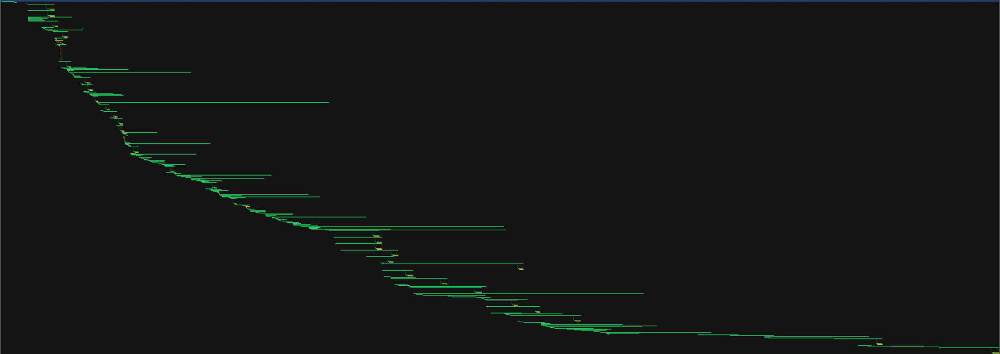
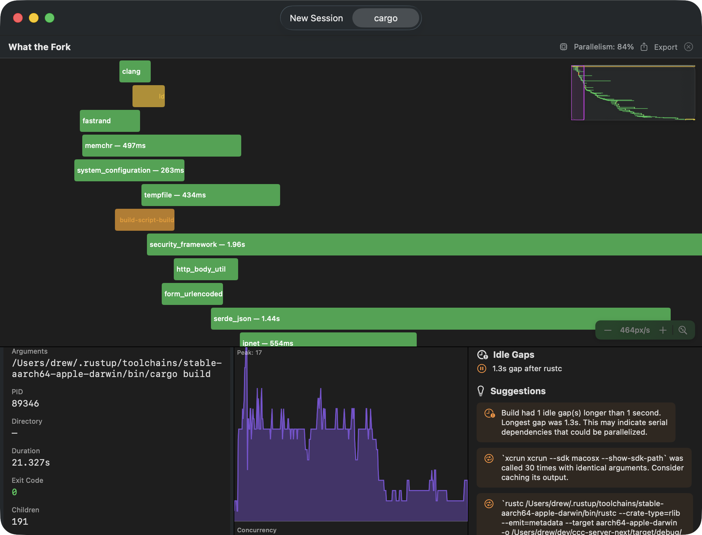

# What the Fork 🍴

A macOS-native tool that visualizes your build process as an interactive timeline, so you can spot slowdowns, serial bottlenecks, and wasted work.

Named after the `fork()` syscall.

**Vector (SVG):**


**Raster (PNG):**


*Screenshots showing interactive process tree with idle time gaps and critical path highlighting.*

## Usage

```bash
wtf make
wtf cargo build
wtf npm run build
wtf xcodebuild
```

Launches the app, which updates live as your build runs.

## How It Works

`wtf` uses Apple's [Endpoint Security Framework](https://developer.apple.com/documentation/endpointsecurity) to intercept `fork`, `exec`, and `exit` syscalls during your build, then reconstructs the full process tree and analyzes it for inefficiencies.

## Building

Requirements:

- macOS 13+
- Xcode 15+
- [xcodegen](https://github.com/yonaskolb/XcodeGen): `brew install xcodegen`

```bash
git clone https://github.com/drewvolz/what-the-fork
cd what-the-fork
xcodegen generate
xcodebuild -project WhatTheFork.xcodeproj -scheme wtf -derivedDataPath build/DerivedData build
```

## Installation

The daemon must run as **root** — ESF (`es_new_client`) requires `geteuid() == 0` regardless of SIP status. The install script builds the daemon and registers it as a system LaunchDaemon:

```bash
sudo bash scripts/install-daemon.sh
```

This installs to `/Library/Application Support/WhatTheFork/` and registers `/Library/LaunchDaemons/com.whatthefork.daemon.plist`. The daemon starts **on demand** when `wtf` runs.

To uninstall:

```bash
sudo launchctl bootout system/com.whatthefork.daemon
sudo rm /Library/LaunchDaemons/com.whatthefork.daemon.plist
sudo rm -rf "/Library/Application Support/WhatTheFork"
```

> **SIP Note:** ESF requires SIP to be disabled for local development builds (unsigned entitlement). Run `csrutil disable` from Recovery Mode. Apple-approved distributions with the provisioned entitlement work with SIP enabled.

## Usage

```bash
wtf make
wtf cargo build
wtf copilot
wtf xcodebuild -project WhatTheFork.xcodeproj -scheme wtf -derivedDataPath build/DerivedData build

# GUI apps or long-running processes (press Ctrl+C to stop capturing):
wtf /path/to/MyApp.app/Contents/MacOS/MyApp
```

The `wtf` CLI launches the command, opens WhatTheFork.app, streams events live, then finalizes the timeline when the command exits (or you press Ctrl+C).

## Running Tests

```bash
cd WTFCore && swift test
```

## Architecture

- `WTFCore/` — Pure Swift package: tree building, parallelism analysis, gap detection, suggestions
- `WTFDaemon/` — Privileged helper: ESF subscription, XPC event server
- `WTFApp/` — SwiftUI app: timeline visualization, analysis panels
- `wtf/` — CLI tool: launches builds, connects daemon and app
